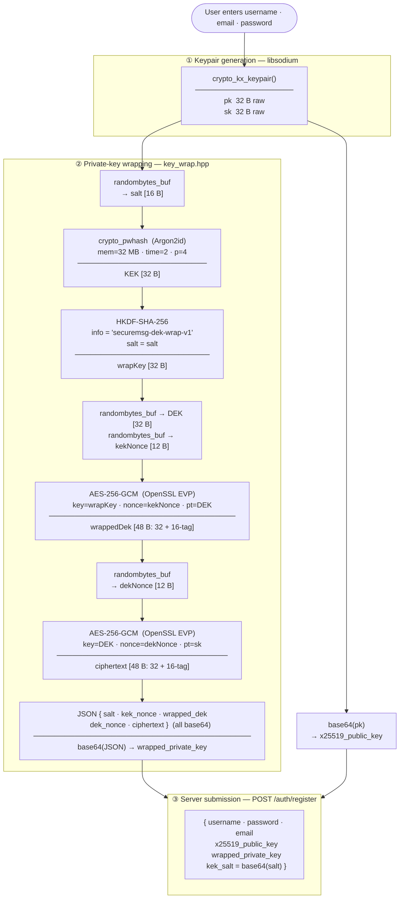
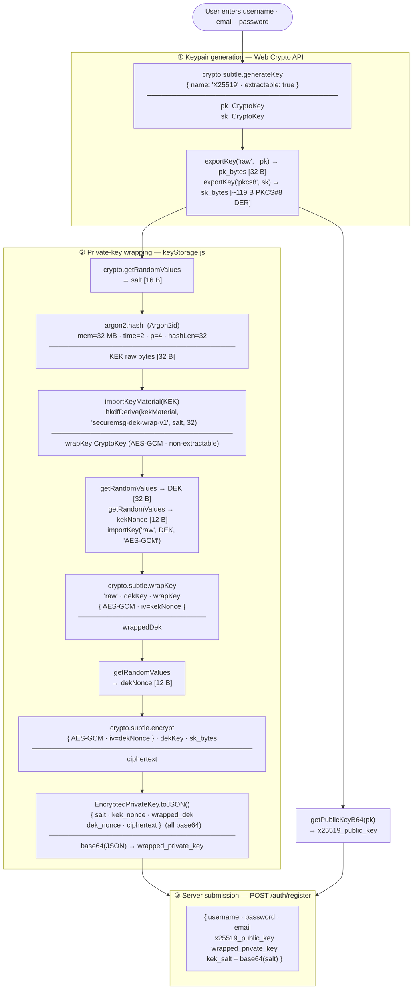
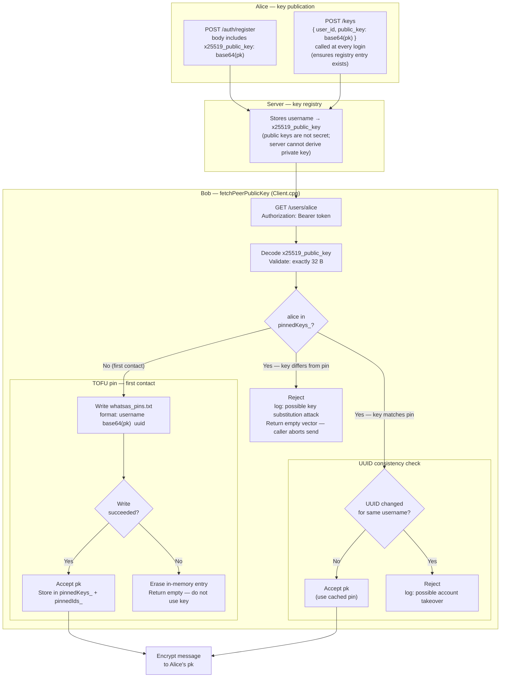
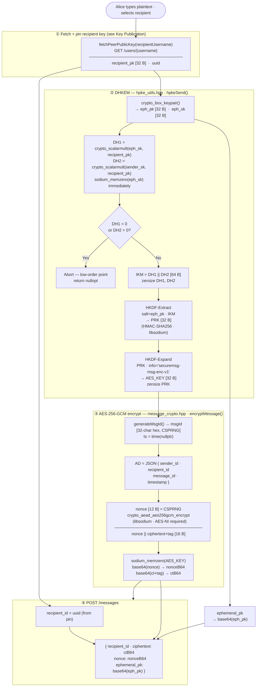
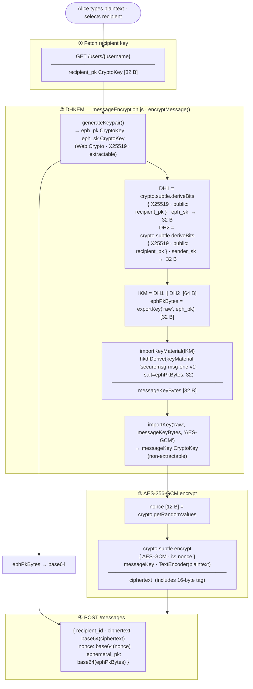
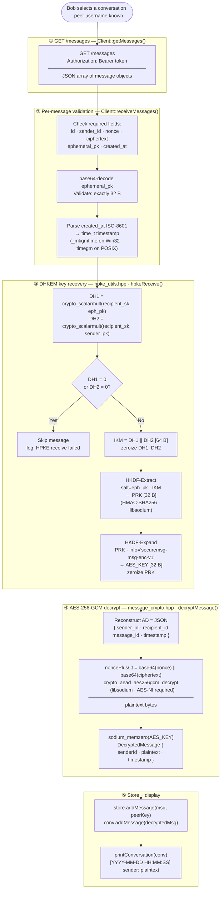
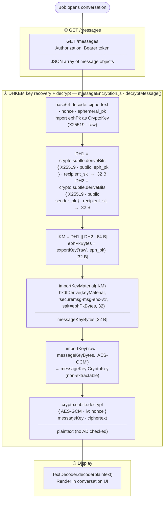
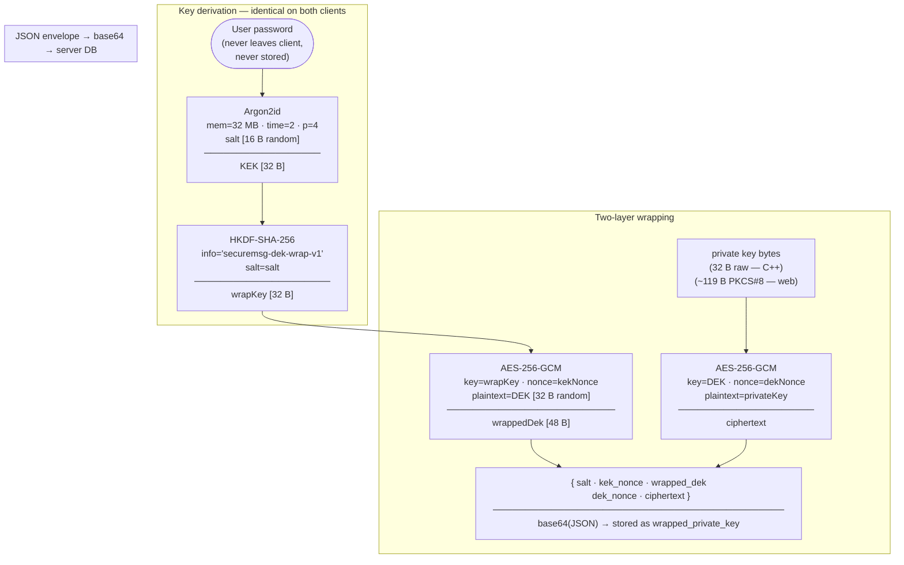
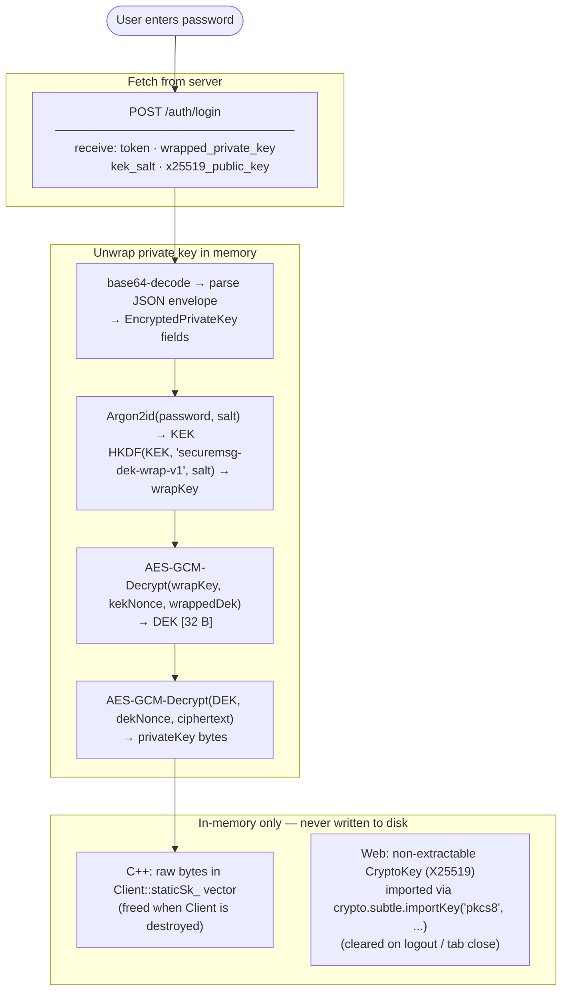

# WhatSaS Crypto Design

## Registration

Both clients generate an X25519 keypair, derive a Key Encryption Key (KEK) from the
user's password using Argon2id, wrap a random Data Encryption Key (DEK) with that KEK,
encrypt the private key with the DEK, and POST the public key plus the wrapped private
key envelope to `/auth/register`.  The server stores the public key in the key registry
and the wrapped private key blob for later retrieval at login.  The plaintext private key
and the password never leave the client.

---

### Key derivation chain (shared by both clients)

```
password + salt [16 B random]
        │
        ▼  Argon2id  (mem = 32 MB · time = 2 · p = 4 · hashLen = 32)
       KEK [32 B]
        │
        ▼  HKDF-SHA-256  (info = "securemsg-dek-wrap-v1"  ·  salt = salt above)
    wrapKey [32 B]
        │
        ├──────────────────────────────────────────────────────────────────┐
        │                                                                  │
        ▼  AES-256-GCM  (nonce = kekNonce [12 B])                         │
  wrappedDek  ◄──── random DEK [32 B]                                     │
                             │                                             │
                             ▼  AES-256-GCM  (nonce = dekNonce [12 B])    │
                       ciphertext  ◄──── private key bytes                │
                                                                           │
Wire envelope ─────────────────────────────────────────────────────────────┘
  base64( JSON({ salt, kek_nonce, wrapped_dek, dek_nonce, ciphertext }) )
```

---

### C++ client registration flow



---

### Web client registration flow



---

### Parameter reference

| Parameter | Value | Where set |
|-----------|-------|-----------|
| Argon2id memory | 32 MB (32 768 KiB) | `key_wrap.hpp` · `kek.js` |
| Argon2id iterations | 2 | `key_wrap.hpp` · `kek.js` |
| Argon2id parallelism | 4 | `key_wrap.hpp` · `kek.js` |
| KEK length | 32 B | `KEK_LEN` · `hashLen` |
| Salt length | 16 B | `SALT_LEN` · `generateSalt()` |
| HKDF hash | SHA-256 | `crypto_utils.hpp` · `hkdf.js` |
| HKDF info (DEK wrap) | `"securemsg-dek-wrap-v1"` | `hkdf_info.hpp` · `constants.js` |
| DEK length | 32 B | `DEK_LEN` · inline |
| AES-GCM nonce | 12 B | `NONCE_LEN` · `getRandomValues` |
| AES-GCM tag | 16 B | OpenSSL default · Web Crypto default |

---

### Interoperability note

The outer envelope format and all Argon2id / HKDF parameters are identical between the
two clients.  The inner plaintext differs:

| | C++ client | Web client |
|---|---|---|
| Private key format | Raw 32 B (`crypto_kx_keypair`) | PKCS#8 DER ~119 B (`exportKey('pkcs8', ...)`) |
| AES-256-GCM implementation | OpenSSL `EVP_EncryptInit_ex` | `crypto.subtle.wrapKey` / `encrypt` |
| HKDF implementation | libsodium HMAC-SHA-256 (`hkdfExtract` / `hkdfExpand32`) | `crypto.subtle.deriveBits` (HKDF) |

Because the decrypted private key byte lengths differ (32 B vs ~119 B), a wrapped key
produced by one client cannot be unwrapped by the other.  Each client validates the
length of the recovered key before use and will reject the other's format.

---

## Key Publication and TOFU Pinning

### Overview

Alice's public key reaches the server via two paths:

1. **At registration** — included in the `POST /auth/register` body as `x25519_public_key`.
2. **At every login** — `POST /keys` is called immediately after login in case the registry
   entry was lost (e.g. server database restore).  The server treats this as an upsert.

Bob fetches Alice's key on first message via `GET /users/alice`, then pins it locally.
All subsequent fetches compare the server response against the pin; any deviation is
treated as a potential key-substitution attack and rejected before the key is used.

---

### Flow diagram



---

### Pin file format

```
# WhatSaS TOFU key pins — do not edit manually
alice   base64(alice_pk_32B)   550e8400-e29b-41d4-a716-446655440000
bob     base64(bob_pk_32B)     6ba7b810-9dad-11d1-80b4-00c04fd430c8
```

One line per peer: `username  base64(pk)  server-uuid`.  The UUID column was added
after initial release; lines with only two tokens load without a UUID (remap check
activates once the UUID is next seen from the server).

---

### Trust model

| Threat | Can server do it? | Why / mitigation |
|--------|-------------------|------------------|
| Read plaintext messages | **No** | Messages are AES-256-GCM encrypted to the recipient's X25519 public key; the server never holds a private key |
| Read the wrapped private key | **No** | Blob is AES-256-GCM encrypted under a password-derived key (Argon2id); password never sent to server |
| Forge a message from Alice to Bob | **No** | Encryption uses Alice's static private key (DHKEM); server does not have it |
| Substitute Alice's public key before Bob's first contact | **Yes (first-contact only)** | A compromised server can serve a different key to Bob on the very first `GET /users/alice`; after that, the TOFU pin prevents substitution |
| Substitute Alice's key after Bob has pinned it | **No** | Client rejects any key that differs from the stored pin and logs a warning |
| Remap Alice's username to a different account UUID | **No** | Client detects UUID change for a pinned username and rejects the response |
| Prevent communication (denial of service) | **Yes** | Server controls message delivery; this is out of scope for the crypto layer |

The first-contact window is the sole residual trust assumption.  Users who need stronger
guarantees should verify Alice's public key fingerprint out-of-band before sending the
first message.

---

## Send Message

### Overview

Every message derives a fresh AES-256-GCM key via a two-DH HPKE-style construction
(DHKEM(X25519, HKDF-SHA256)).  The ephemeral private key is zeroized immediately after
the two DH operations; the AES key is zeroized after encryption.  The server receives
only the ciphertext, the ephemeral public key, and the nonce — never any key material.

### DHKEM key derivation (both clients)

```
Sender holds:  sender_sk  (long-term, 32 B)
               recipient_pk (fetched + TOFU-pinned, 32 B)

① fresh eph_sk / eph_pk  (32 B each, CSPRNG)

② DH1 = X25519(eph_sk,    recipient_pk)   [32 B]  — forward secrecy
   DH2 = X25519(sender_sk, recipient_pk)   [32 B]  — sender authentication

   eph_sk  zeroized immediately after ②

③ low-order check: abort if DH1 = 0 or DH2 = 0

④ IKM = DH1 || DH2  [64 B]  →  zeroize DH1, DH2

⑤ PRK = HKDF-Extract(salt = eph_pk, IKM)  →  zeroize IKM

⑥ AES_KEY = HKDF-Expand(PRK, info = "securemsg-msg-enc-v1")  [32 B]  →  zeroize PRK

⑦ nonce [12 B] = CSPRNG

⑧ ciphertext+tag = AES-256-GCM(AES_KEY, nonce, plaintext [, AD])  →  zeroize AES_KEY

Wire fields sent to POST /messages:
  ephemeral_pk  base64(eph_pk)
  nonce         base64(nonce)
  ciphertext    base64(ciphertext + 16-byte tag)
  recipient_id  server UUID (from TOFU pin)
```

---

### C++ client send flow



---

### Web client send flow



---

### DHKEM parameter reference

| Parameter | Value | Where set |
|-----------|-------|-----------|
| KEM | DHKEM(X25519) | `hpke_utils.hpp` · `messageEncryption.js` |
| DH function | X25519 (`crypto_scalarmult`) | libsodium · Web Crypto |
| HKDF hash | SHA-256 | `crypto_utils.hpp` · `hkdf.js` |
| HKDF salt | `eph_pk` [32 B] | both clients |
| HKDF info (message key) | `"securemsg-msg-enc-v1"` | `hkdf_info.hpp` · `constants.js` |
| AES key length | 32 B (AES-256) | both clients |
| AES nonce | 12 B (CSPRNG) | both clients |
| AES tag | 16 B (GCM default) | both clients |
| AES implementation | libsodium `crypto_aead_aes256gcm` (AES-NI) | C++ only |
| AES implementation | `crypto.subtle.encrypt` (AES-GCM) | web only |
| Forward secrecy | Per-message ephemeral keypair | both clients |

---

### Cross-client interoperability note

The DHKEM construction and all key derivation parameters are identical, so both clients
produce the same AES key from the same inputs.  However, the AES-GCM **additional data
(AD)** usage differs:

| | C++ client | Web client |
|---|---|---|
| AD bound into AEAD tag | `JSON { sender_id, recipient_id, message_id, timestamp }` | none — `crypto.subtle.encrypt` called without `additionalData` |
| AES-GCM implementation | libsodium `crypto_aead_aes256gcm_encrypt` (requires AES-NI) | `crypto.subtle.encrypt` |

Because the AD is mixed into the authentication tag, a ciphertext produced by the C++
client will fail AEAD verification when the web client tries to decrypt it (no AD
provided), and vice versa.  The two clients currently form separate ciphertext domains
and cannot decrypt each other's messages.

---

## Receive Message

### Overview

The recipient re-derives the same per-message AES key using their own long-term private
key, the sender's long-term public key (TOFU-pinned), and the ephemeral public key
carried in the wire message.  X25519 symmetry guarantees the two DH outputs are
identical to those the sender computed, so the same HKDF chain produces the same
AES key.  No key material is transmitted; the server cannot decrypt.

### DHKEM key recovery (both clients)

```
Recipient holds:  recipient_sk  (long-term, 32 B)
                  sender_pk     (fetched + TOFU-pinned, 32 B)

Wire fields from GET /messages:
  eph_pk       base64 → [32 B]   (kem_output sent by sender)
  nonce        base64 → [12 B]
  ciphertext   base64 → [N + 16 B tag]

① DH1 = X25519(recipient_sk, eph_pk)    ≡ sender's X25519(eph_sk, recipient_pk)
   DH2 = X25519(recipient_sk, sender_pk) ≡ sender's X25519(sender_sk, recipient_pk)

   (X25519 symmetry: X25519(a, B·G) = X25519(b, A·G) = a·b·G)

② low-order check: abort if DH1 = 0 or DH2 = 0

③ IKM = DH1 || DH2  [64 B]  →  zeroize DH1, DH2

④ PRK = HKDF-Extract(salt = eph_pk, IKM)  →  zeroize IKM

⑤ AES_KEY = HKDF-Expand(PRK, info = "securemsg-msg-enc-v1")  [32 B]  →  zeroize PRK

⑥ plaintext = AES-256-GCM-Decrypt(AES_KEY, nonce, ciphertext [, AD])  →  zeroize AES_KEY
```

---

### C++ client receive flow



---

### Web client receive flow



---

### Security properties

| Property | Mechanism |
|----------|-----------|
| Confidentiality | AES-256-GCM; only the recipient's private key can recover DH1 |
| Sender authentication | DH2 = X25519(recipient_sk, sender_pk); a forged message cannot reproduce DH2 without sender_sk |
| Forward secrecy | Each message uses a fresh ephemeral keypair; compromise of long-term keys does not expose past messages |
| Integrity (C++ client) | AEAD tag covers ciphertext + AD (sender, recipient, message ID, timestamp); any field tampering causes decryption failure |
| Integrity (web client) | AEAD tag covers ciphertext only; AD not used — sender/recipient/timestamp fields are not authenticated by the tag |
| Key zeroization | `sodium_memzero` on eph_sk, DH1, DH2, IKM, PRK, AES_KEY after each use (C++ client) |

---

## At-Rest Storage

### Overview

The X25519 private key is **never written to disk in plaintext** by either client.  The
only persisted form is the wrapped envelope, which lives in the server database.  Even
with full read access to the database, an attacker cannot recover the private key without
the user's password — the password is never transmitted to or stored by the server.

Local disk writes per client:

| Client | What is written to disk | Where |
|--------|------------------------|-------|
| C++ | TOFU public-key pins only (no private key) | `whatsas_pins.txt` |
| Web | JWT in `sessionStorage` only (cleared on tab close); private key held in JS heap only | browser session |

### Wrapped key envelope (server database)

The server stores three fields per user in the `users` table:

```
users table row
├── x25519_public_key  ──  base64(pk [32 B])        ← public; not secret
├── kek_salt           ──  base64(salt [16 B])       ← public Argon2id salt
└── wrapped_private_key ── base64(JSON envelope)    ← encrypted blob

JSON envelope (inner, before outer base64):
{
  "salt":        base64( salt       [16 B] )   ← Argon2id salt (same as kek_salt)
  "kek_nonce":   base64( kekNonce   [12 B] )   ← AES-GCM nonce for DEK wrap
  "wrapped_dek": base64( wrappedDek [48 B] )   ← AES-GCM(wrapKey, kekNonce, DEK) + 16-byte tag
  "dek_nonce":   base64( dekNonce   [12 B] )   ← AES-GCM nonce for private key
  "ciphertext":  base64( ct         [?B]  )    ← AES-GCM(DEK, dekNonce, privateKey) + 16-byte tag
}
```

C++ ciphertext is 48 B (32 B raw key + 16 B tag).
Web ciphertext is ~135 B (~119 B PKCS#8 DER key + 16 B tag).

### Key derivation and wrapping diagram



### In-memory lifecycle at login



### What a database compromise reveals

| Data item | Stored on server | Recoverable by attacker with DB access |
|-----------|-----------------|----------------------------------------|
| X25519 public key | Yes (plaintext) | Yes — public by design |
| Argon2id salt | Yes (plaintext) | Yes — needed to attempt offline dictionary attack |
| Wrapped DEK | Yes (ciphertext) | Only if password is guessed; Argon2id (32 MB / 2 iterations) makes brute-force expensive |
| Private key | No — only the AES-GCM ciphertext | Only after unwrapping DEK; requires password |
| Plaintext messages | No — ciphertext only | Never; requires recipient private key |
| User password | Never stored | Never — only a hash is stored for login authentication |

The sole offline attack surface is a dictionary attack on `wrapped_private_key` guarded
by Argon2id (32 MB memory, 2 iterations, parallelism 4).  A weak password remains the
primary residual risk.
